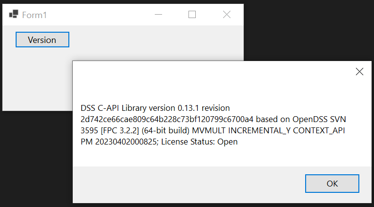
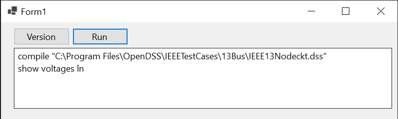
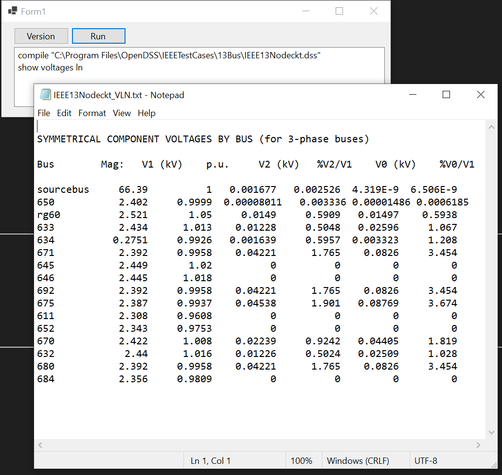
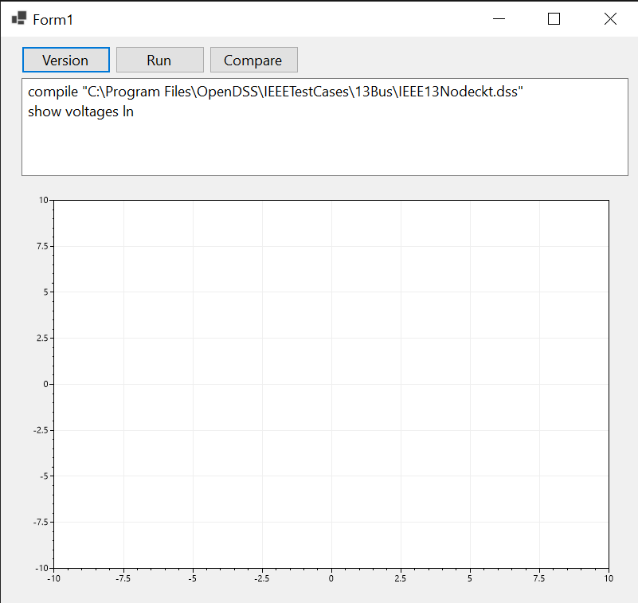
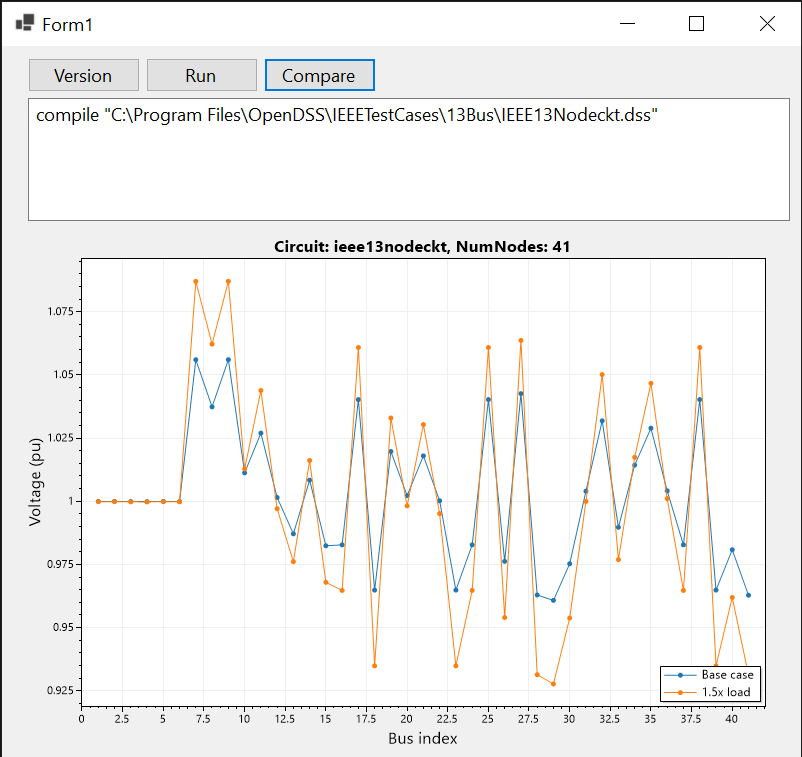

# WinForms + dss_sharp

## Initial setup

- From Visual Studio's home screen, select "Create a new project"
- Select "Windows Forms App"
- For the prepared version here, we typed "WinFormsAppSample" as name, and marked the option to "Place solution and project in the same directory".
- After the project is created, open the "Project" item in the top menu bar, and select "Manage NuGet Packages..."
- Activate/click the "Browse" tab and type dss_sharp in the search box.
- Our package should be listed; you should recognize the icon. Click it to show its description, then click the "Install" button.
- By installing, on the default settings, the package is automatically added to the project. You can now proceed to code!

## Checking the version

- Add a button. You can do so by double-clicking or dragging a button from the Toolbox. If you don't see the toolbox, click View>Toolbox. 
- Change this button's text to "Version".
- Double-click the button. This will show you the code editor for the "Click" event.
- First, add `using dss_sharp;` to top of the file.
- Add a new class member of the type `DSS`. We called it "engine".
- On the form constructor, create the object.
- Finally, in the click event method, use `MessageBox.Show` to show the string from `engine.Version`.

You code should look like:

```csharp

using dss_sharp;

namespace WinFormsAppSample
{
    public partial class Form1 : Form
    {
        DSS engine;

        public Form1()
        {
            InitializeComponent();
            engine = new DSS();
        }

        private void button1_Click(object sender, EventArgs e)
        {
            MessageBox.Show(engine.Version);
        }
    }
}
```

Build and run, then click the button to ensure it's working. When run, this is an example output when clicking the button:

<p align="center">
    
</p>


## Running a DSS script

- Now add a textbox, and another button. 
- Change the "Multiline" property of the textbox to true, and resize it to be big enough.
- Change the button's text to "Run".
- Double-click the button, and make sure you fill the new method like the following:

```csharp
        private void button2_Click(object sender, EventArgs e)
        {
            var lines = textBox1.Lines;
            foreach (var line in lines) 
            {
                try
                {
                    engine.Text.Command = line;
                }
                catch (DSSException ex)
                {
                    MessageBox.Show(ex.Message);
                    break;
                }
            }
        }
```

- Finally, build and run again. If you have OpenDSS installed in the default folder, you can paste this in your running app (or previously in the Text property of the textbox):

```
compile "C:\Program Files\OpenDSS\IEEETestCases\13Bus\IEEE13Nodeckt.dss"
show voltages ln
```

<p align="center">
    
</p>

And click run!

If everything is done correctly, you should get a new text editor for the voltage results from the sample circuit. 
If the file doesn't exist, you should instead get a new message box telling you something like "Redirect file not found...".

<p align="center">
    
</p>

## Multiple scenarios and better control through the API

Although running scripts and exporting text files is useful, the main advantanges of the APIs (either dss_sharp or the official COM module), 
is the ability to get numeric data directly for different scenarios according to the analysis the user is required to achieve.

For example, suppose you wanted to compare the voltages for two scenarios of load. 

```csharp
    engine.ActiveCircuit.Solution.LoadMult = 1.0;
    engine.ActiveCircuit.Solution.Solve();
    var voltages_base = engine.ActiveCircuit.AllBusVmagPu;

    engine.ActiveCircuit.Solution.LoadMult = 1.5;
    engine.ActiveCircuit.Solution.Solve();
    var voltage_150 = engine.ActiveCircuit.AllBusVmagPu;
```

You can of course get references to the API elements to make the code less verbose, for example:

```csharp
    var circ = engine.ActiveCircuit;
    
    circ.Solution.LoadMult = 1.0;
    circ.Solution.Solve();
    var voltages_base = circ.AllBusVmagPu;

    circ.Solution.LoadMult = 1.5;
    engine.ActiveCircuit.Solution.Solve();
    var voltage_150 = circ.AllBusVmagPu;
```

You are free to use various methods and other .NET packages to compare and evaluate the voltage arrays.

## Adding a chart

To better illustrate, let's add a simple chart of the voltages for difference load scenarios. 

- First, open the Manage NuGet Packages again, and this time install "ScottPlot.WinForms". This will also install several dependencies.

- After the installation, a new item named "FormsPlot" will be available in the Toolbox. Add one to your form.

- Now add a third button. Change its label to "Compare". You form should look like the example below.

<p align="center">
    
</p>

- Add the following code to its click event handler (read the comments!):

```csharp
        private void button3_Click(object sender, EventArgs e)
        {
            // Try running the test circuit
            try
            {
                engine.Text.Command = @"compile 'C:\Program Files\OpenDSS\IEEETestCases\13Bus\IEEE13Nodeckt.dss'";
            }
            catch (DSSException ex)
            {
                MessageBox.Show(ex.Message);
                return;
            }
        
            var circ = engine.ActiveCircuit;

            // Create an array for the x-axis and clear any previous plot
            var x = new double[circ.NumNodes];
            for (int i = 0; i < x.Length; ++i)
            {
                x[i] = i + 1;
            }
            var plot = formsPlot1.Plot;
            plot.Clear();

            // Ensure the solution mode is snapshot, and solve the base case
            circ.Solution.Mode = (int)SolveModes.dssSnapShot;
            circ.Solution.LoadMult = 1.0;
            circ.Solution.Solve();

            // Be sure to check the convergency since it doesn't necessarily becomes
            // an error/exception if the system fails to converge.
            if (!circ.Solution.Converged)
            {            
                MessageBox.Show("Failed to converge.");
                return;
            }
            
            // Add the base plot
            plot.AddScatter(x, circ.AllBusVmagPu, label: "Base case");

            // Solve the 1.5x load case, add it to the plot
            circ.Solution.LoadMult = 1.5;
            circ.Solution.Solve();
            if (!circ.Solution.Converged)
            {            
                MessageBox.Show("Failed to converge.");
                return;
            }
            
            plot.AddScatter(x, circ.AllBusVmagPu, label: "1.5x load");

            // Finishing touches to the chart
            plot.Legend();
            plot.XLabel("Bus index");
            plot.YLabel("Voltage (pu)");
            plot.Title($"Circuit: {circ.Name}, NumNodes: {circ.NumNodes}");

            formsPlot1.Refresh();
        }
```

Finally, running the app and clicking compare should give a nice chart:

<p align="center">
    
</p>


For most users, this is enough to get the handle of how things work, so we left the sample application
on this point. If you whish to allow your application to run with both the official COM DLL and dss_sharp,
continue below.

## Comparing to the official OpenDSS COM DLL

This project tries to be very compatible with the official COM API, but there are some niceties that are lost when
keeping the code fully compatible. We also avoid adding some conveniences to dss_sharp to keep the codebase more
compatible. This could change in the future, but we would likely create a separate API while maintaining this
classic API for compatibility.

To be able run with the official OpenDSS, add a COM Reference in the Dependencies list (e.g. in the Solution Explorer). Search for "OpenDSS Engine" and mark its checkbox.

Now, there's adjust the code to make it work with both versions.

The first step is to change the the `using` clause. To make it easier to use both versions, we can replace `using dss_sharp;` with:

```csharp
#if USE_DSS_SHARP
using dss_sharp;
#else
using OpenDSSengine;
#endif
```

The initialization could also be adjusted to disable certain dss_sharp features

```csharp
        public Form1()
        {
            InitializeComponent();
            engine = new DSS();
            engine.Start(0);
            engine.AllowForms = false;
#if USE_DSS_SHARP
            // Disable the automatic error-to-exception mapping
            dss_sharp.Error.UseExceptions = false;

            // Disable the early-abort mechanism.
            // Without it, the engine may continue to run ignoring
            // some errors -- we highly advice against it, but you
            // may need to do this to check your COM-based code before
            // migrating to dss_sharp.
            engine.Error.EarlyAbort = false;

            // There are other flags that could be useful;
            // check the documentation of dss_sharp itself
            // and DSS C-API for more insight.
#endif
        }
```

And, without exception, we need to manually check the error number for most of
API calls. For example, our previous `button2_Click` now becomes:

```csharp
        private void button2_Click(object sender, EventArgs e)
        {
            var lines = textBox1.Lines;
            foreach (var line in lines)
            {
                engine.Text.Command = line;
                if (engine.Error.Number != 0)
                {
                    MessageBox.Show(engine.Error.Description);
                    break;
                }
            }
        }
```

If you now run the compiled app, you would be running using the official COM version of OpenDSS. And, with the conditional compilation of the initialization in place, you can easily toggle using dss_sharp.

To use dss_sharp, just open the project properties, and add `USE_DSS_SHARP` to the custom symbols list (both "Debug Custom Symbols" and "Release Custom Symbols"). So, if instead of WinForms we used a 
multi-platform UI like [Avalonia](https://avaloniaui.net/), we could achieve multi-platform OpenDSS usage in .NET, which still maintaining the option to test with the official engine.

### A warning about "EarlyAbort"

To understand this flag (API Extension) from dss_sharp, create a text file, e.g. `c:\temp\errorsample.dss`, with the following contents:

```
compile "C:\Program Files\OpenDSS\IEEETestCases\13Bus\IEEE13Nodeckt.dss"
new TRANSFORMER.SUB
show voltages ln
```

The second line contains an error: there is already a transformer element name "sub" in the circuit!

Now, try to run it with our sample app, e.g. type `compile c:\temp\errorsample.dss` in the textbox and click Run.

With the official COM version, with `AllowForms = false` (typical for automation and large scale projects), you not only will get the
output from `show voltages ln`, but will also get no error!

When we set `engine.Error.EarlyAbort = false` on dss_sharp, you will get the same dangerous behavior.

On the other hand, the default behavior of dss_sharp and DSS Extensions in general, with `engine.Error.EarlyAbort = true`,
is to stop the execution on the first error found. As such, we avoid the risk of silently ignoring errors in automated/unattended 
large scale simulations.

